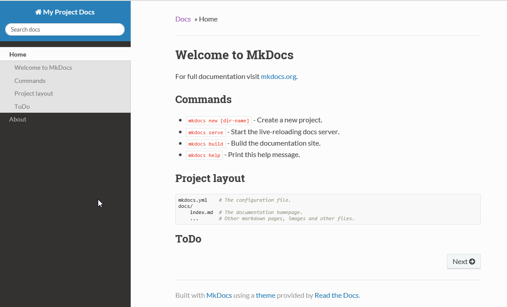
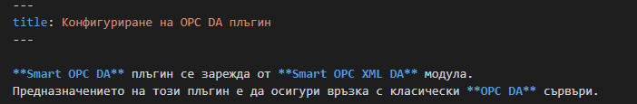

[TOC]

Създайте папка **MkDocs** примерно в "**C:\\**". Отворете команден
промпт и отидете в папка **MkDocs**. От "**File Explorer**" десен клик на
мишката върху папката като едновременно с това сте натиснали и задържали
левият „**Shift**" на клавиатурата и изберете "**Open command window
here**".


**<center>фиг.17</center>**

За да създадете нов проект на документация, изпълнeте следната команда:

```cmd
mkdocs new MyFirstDoc
```


**<center>фиг.18</center>**

В резултат на това се създаде папка **MyFirstDoc** в **MkDocs**.


**<center>фиг.19</center>**

В тази папка има подпапка "**Docs**", в която се помещават всички
**Markdown** документи и един конфигурационен файл **mkdocs.yml**, в
който се конфигурира текущият проект.

Отворете "**File Explorer**", десен бутон на мишката върху папката
"**MyFirstDoc**" и изберете "**Open with Code**"


**<center>фиг.20</center>**


**<center>фиг.21</center>**

След като сте отворили папката на проекта във **VS Code**, вляво виждате
дървото, разпънете папката **docs** и ще видите файла **index.md**. Това
е **markdown** файл което се създава автоматично при създаването на
проекта. Кликнете върху **index.md** и вдясно ще се отвори файла и ще се
оцети кода, тъй като **VS Code** разпознава **markdown** файли.

В горният десен ъгъл на редактора има бутон , 
който ако го натиснете ще се отвори преглед на файла, как би изглеждал
ако примерно се качи в **GitHub** или пък се генерира сайт от него в
последствие.

**MkDocs** позволява да прегледате проекта как би изглеждал ако
генерирате статичен сайт от проекта. От меню лентата най-отгоре на
редактора изберете „**Terminal**" и изберете „**New Terminal**".


**<center>фиг.23</center>**

В резултат в редактора отдолу ще се отвори терминален прозорец в папката
на проекта.


**<center>фиг.24</center>**

Можете да пускате колко искате терминални прозорци, като вдясно има
падащ списък, от който може да ги сменяте.


**<center>фиг.25</center>**

Командният промпт тук е **PowerShell**.

За да прегледате как би изглеждал сайт на документа напишете следната
команда в терминалния прозорец на редактора: **mkdocs serve**


**<center>фиг.26</center>**

В резултат на това ще се стартира на локалната машина на порт 8000
сайта.

Отворете браузъра и навигирайте до <http://127.0.0.1:8000>


**<center>фиг.27</center>**

Така ще изглежда сайта на документацията с темата по подразбиране.
Оставете сайта отворен и направете промяна във файла **index.md**,
използвайте **Ctrl+S** за да запишете промените. Ако не сте
затворили браузъра, би трябвало страничката автоматично да се презареди
и да ви покаже промяната която се направили.


**<center>фиг.28</center>**


**<center>фиг.29</center>**

Ако искате да прекъснете изпълнението, просто трябва да натиснете
**Ctrl+C** в терминалния прозорец.

Ако искате да създадете статичен сайт, може или да спрете изпълнението в
текущият терминален прозорец или да отворите нов (**Ctrl+Shift+\`**), и
в него да изпълните следната команда: 

```cmd
mkdocs build
```


**<center>фиг.30</center>**

В резултат на изпълнението на командата ще се компилира проекта и ще се
създаде статичен сайт, записан в папка "**site**". Този статичен сайт
може да се публикува на всеки един уеб сървър (**IIS**, **Apache** и т.н.)

# Добавяне на страници

Кликнете върху **docs** папката.


**<center>фиг.31</center>**

Кликнете с мишката върху  за да добавите нов файл (например **about.md**).


**<center>фиг.33</center>**

Тъй като сайта на документацията има навигация, може да редактирате
конфигурационният файл и да добавите информация за подредбата,
заглавията и вграждането на всяка една страница в навигационният панел,
чрез добавяне на [nav ](https://www.mkdocs.org/user-guide/configuration/#nav)(преди
позната като **pages**) настройка:

Кликнете върху файл **mkdocs.yml** и го редактирайте:


**<center>фиг.34</center>**

Страничката би трябвало автоматично да се е опреснила, след което ще
видите в навигационната лента най-горе се появи меню „**About**":


**<center>фиг.35</center>**

# Конфигуриране на името на сайта

Конфигурирането на името на сайта става с настройка **site\_name** в
**mkdocs.yml**:


**<center>фиг.36</center>**

На темата по подразбиране това ще се отрази по следният начин:


**<center>фиг.37</center>**

# Конфигуриране темата на сайта

Редактирайте **mkdocs.yml** файла, като добавите настройка
[theme](https://www.mkdocs.org/user-guide/configuration/#theme):


**<center>фиг.38</center>**

В резултат на което сайта ще изглежда така:



**<center>фиг.39</center>**

# Вграждане на нива в навигационният панел

В конфигурационният файл въведете следното в **nav** секцията (добавете
си и файлове **introduction.md** и **configuration.md** за да не ви даде
грешка, че имате навигация към несъществуващ файл):


**<center>фиг.40</center>**

В резултат на сайта в навигационният панел вляво виждаме следното:


**<center>фиг.41</center>**

# Разширения

**MkDocs** използва **Python Markdown** библиотека за да преведе
**Markdown** файловете в **HTML**. **Python Markdown** поддържа различни
разширения, които персонализират как страниците се форматират. Тази
настройка позволява да се включат списък от разширения извън тези, които
**MkDocs** използва по подразбиране (**meta**, **toc**, **tables** и
**fenced\_code**). Разширенията се включват и конфигурират в
**mkdocs.yml** файла с настройка **markdown\_extensions**, например:


**<center>фиг.42</center>**

[admonition](https://python-markdown.github.io/extensions/admonition/)
- добавя **rST**(restructured text)-стил на **markdown** документи;

[attr\_list](https://python-markdown.github.io/extensions/attr_list/) -
**Attribute Lists** - разширение добавя синтаксис за дефиниране на
атрибути на различни **HTML** елементи;

[tоc](https://python-markdown.github.io/extensions/toc/) - **Table of
Contents** - генерира съдържание от **markdown** документите в изходния
**HTML**.

[meta](https://python-markdown.github.io/extensions/meta_data) -
**Meta-Data** разширението добавя синтаксис за дефиниране на мета-данни
за документа. Към момента това разширение не използва мета-данните по
никакъв начин, но осигурява мета атрибут за използване от други
разширение или директно от **python** код.



**<center>фиг.43</center>**

Един от начините за дефинирането на мета данните е в началото на всеки
един **markdown** файл началото и края на мета данните да се оградят с
`---`. Ключовите думи не са зависими от размера (големи/малки) на буквите, могат
да съдържат още числа, подчертавки, тирета и трябва да завършат с
двоеточие. След двоеточието може да съдържа всичко, включително празни интервали.
Ако следващият ред съдържа минимум 4 интервала, това се счита за
продължение на съдържанието на предишната ключова дума:


**<center>фиг.44</center>**

Списък с официално поддържаните **Python-Markdown** разширения може да
видите
[тук](https://python-markdown.github.io/extensions/#officially-supported-extensions).
Повече информация за конфигуриране на разширение може да видите
[тук](https://www.mkdocs.org/user-guide/configuration/#markdown_extensions).

# Конвертиране на Word файлове в Markdown формат

За конвертирането на **Word** файлове в **Markdown** формат се използва
[Pandoc](http://pandoc.org/).

Създайте папка **PandocTest**. Копирайте в нея, някой **Word** документ.
Отворете команден промпт в папка **PandocTest** и изпълнете следната
команда, като замените **pandoctest.docx**, с Вашият **Word** файл
документ, както и резултата (**-o pandoctest.md**):

```cmd
pandoc pandoctest.docx -o pandoctest.md --extract-media .
```

В резултат на изпълнението ще се създаде нов **pandoctest.md** файл и
папка **media**, в която ще се намират извлечените изображение от
документа. Някои от изображенията може да бъдат във **EMF** формат, и е
добре да ги преобразувате в **PNG**. Изображенията ще бъдат с имена
imageN.(png \| emf) където N e поредният номер на изображението. Ако има
пропуск в последователността на номерацията, това означава, че има
изображение, което не е могло да бъде извлечено и трябва да го направите
Вие. Обикновено това се случва, ако има вграден обект например от
**Visio**.

Може да отворите папката **PandocTest** с **VS Code**, след което да
изберете **pandoctest.md** файла и да натиснете бутона горе вдясно
 за преглед на документа.


**<center>фиг.46</center>**

Генерираният **markdown** файл представлява „заготовка", която да се
използва при реализирането **MkDocs** документен проект. Трябва да се
прехвърлят разделите в отделни файлове, с цел по-бързо зареждане. Трябва
да се преработи форматиращият **Markdown** код.

Повече информация за употребата на **Pandoc** може да намерите
[тук](http://pandoc.org/MANUAL.html).

# Използване на Writage


[Writage](http://www.writage.com/) е плъгин за **Microsoft Word**, който
позволява да запишете **Word** документ в **Markdown** формат. Също така
ви позволява да отворите **Markdown** документ и директно да го
редактирате. Подобно на **Pandoc** създава папка **media** с
изображенията от **Word** документа, но за разлика от него имената
представляват **GUID** номера, които са трудни за проследяване. Реално
**Writage** използва **Pandoc** за конвертиране. Недостатъкът е че не
може да подавате параметри на конвертирането и се задоволявате с тези,
които са програмно настроени в плъгина.