[TOC]

# Изиквания

-   Операционна **Windows 7** / **Windows 2008 Server** или по-нова;

-   **MkDocs** поддържа **Python** версии **2.7**, **3.4**, **3.5**, **3.6**, **3.7** и **pypy;**

-   **Visual Studio Code**

-   Интернет връзка


# Инсталиране на Python

Изтеглете от [тук](https://www.python.org/ftp/python/3.7.0/python-3.7.0-amd64.exe)
**Python** **3.7** за **Windows**. Стартирайте инсталационен пакет **python-3.7.0-amd64.exe**.

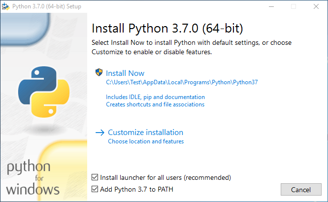

**<center>фиг.1</center>**

След като видите диалога показан на фигурата по-горе сложете отметка на
"**Add Python 3.7 to PATH**" и кликнете върху "**Install Now**".

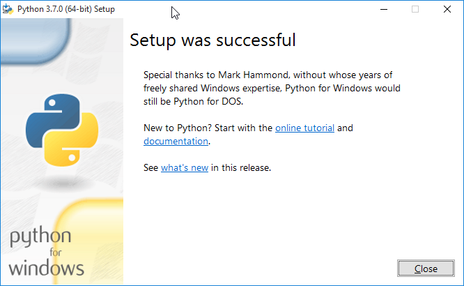

**<center>фиг.2</center>**

Инсталацията завърши. Натиснете бутон "**Close**".

Отворете "**Command Prompt**" и напишете 
```
python --version
``` 
и натиснете **Enter**. Трябва да видите следното:

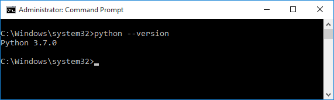

# Инсталиране на Pip

Ако използвате скорошна версия на **Python**, най-вероятно
инсталационният пакет на **Python**, **pip** , е по подразбиране
инсталиран. Възможно е обаче да се наложи да надстроите **pip** към
последната версия:

```cmd
python -m pip install --upgrade pip
```

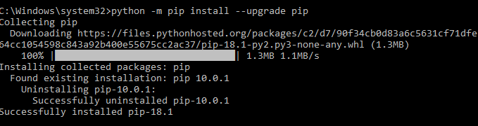

**<center>фиг.4</center>**

# Инсталиране на MkDocs

След като сте инсталирали **Python** за **Windows**, за да инсталирате
**MkDocs** ви е необходим Интернет. Напишете в команден промпт следното:

```cmd
pip install mkdocs
```

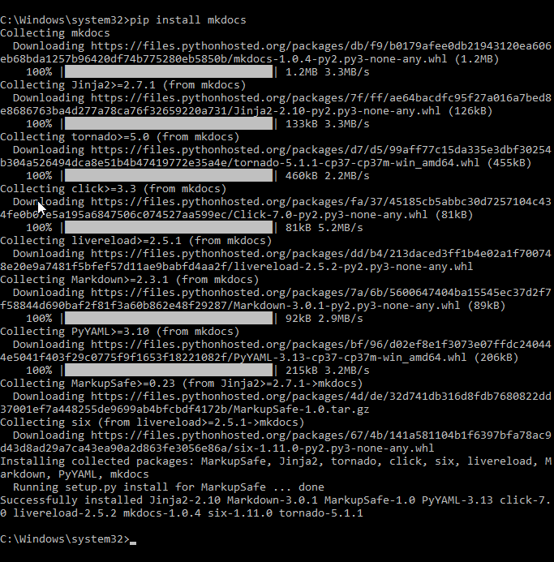

**<center>фиг.5</center>**

# Инсталиране на Visual Studio Code

Изтеглете **Visual Studio Code** от [тук](https://code.visualstudio.com/docs/?dv=win). Стартирайте инсталацията.

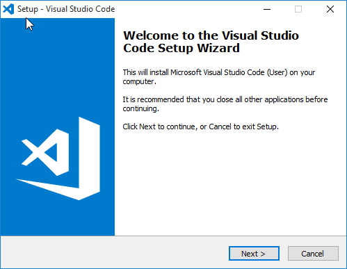

**<center>фиг.6</center>**

Натиснете бутон "**Next**".

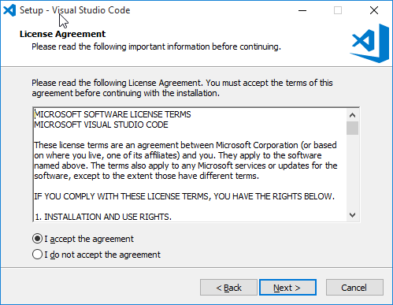

**<center>фиг.7</center>**

Натиснете бутон "**Next**".

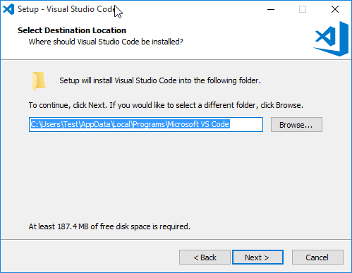

**<center>фиг.8</center>**

Натиснете бутон "**Next**".

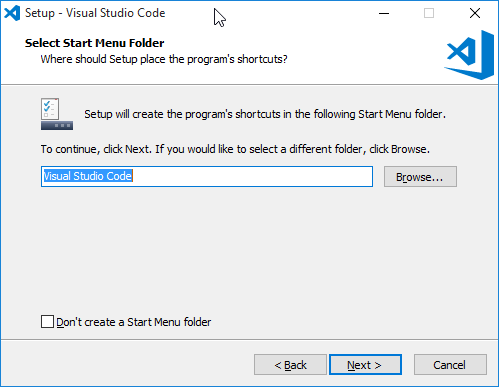

**<center>фиг.9</center>**

Натиснете бутон "**Next**".

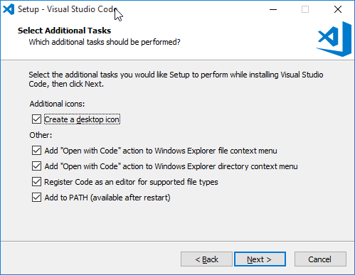

**<center>фиг.10</center>**

Поставете отметките и натиснете бутон "**Next**".

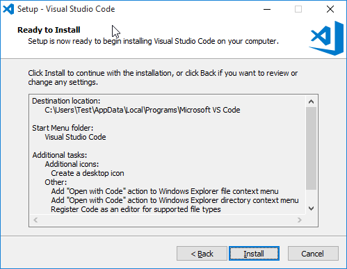

**<center>фиг.11</center>**

Натиснете бутон "**Install**".

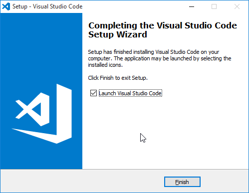

**<center>фиг.12</center>**

Натиснете бутон „**Finish**".

# Инсталиране на Pandoc

Ако няма да конвертирате документи от **Word** в **markdown** формат, пропуснете тази стъпка.

Изтеглете **pandoc** от [тук](https://github.com/jgm/pandoc/releases/download/2.3.1/pandoc-2.3.1-windows-x86_64.msi).
Стартирайте инсталационният файл.

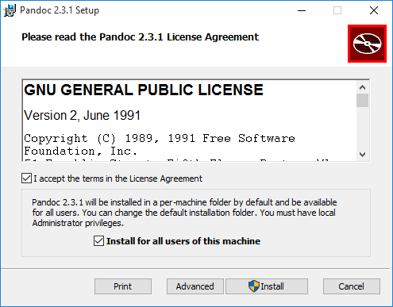

**<center>фиг.13</center>**

Поставете отметките и натиснете "**Install**".

# Инсталиране на Writage

[Writage](http://www.writage.com/) е плъгин за **Microsoft Word**, който
позволява да записвате **Word** документ в **Markdown** формат, както и
да редактирате **Markdown** документи, като **WYSIWYG** редактор с
известни ограничения. Може да пропуснете тази стъпка ако не смятате да
използвате плъгина.

Изтеглете инсталационният пакет от [тук](http://www.writage.com/#download). Стартирайте файла.

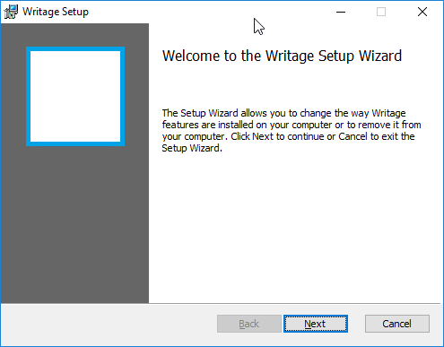

**<center>фиг.14</center>**

Натиснете бутона „**Next**".

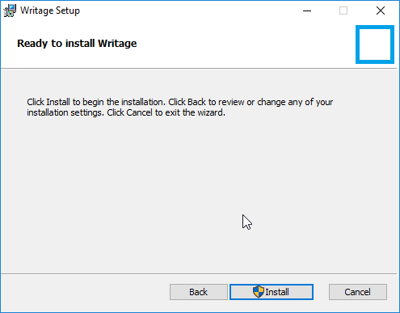

**<center>фиг.15</center>**

Натиснете бутона „**Install**".

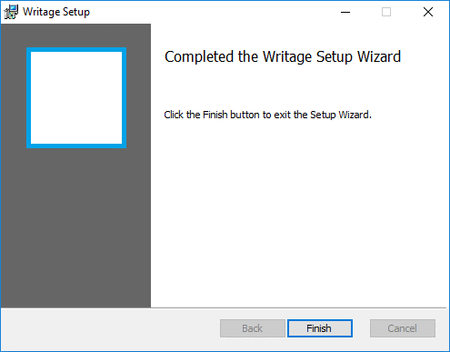

**<center>фиг.16</center>**

Натиснете бутона „**Finish**".
