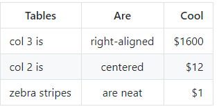
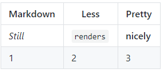
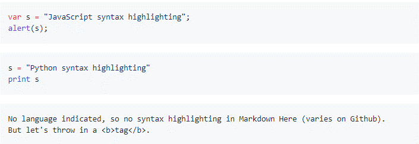

[TOC]

# Философия

**Markdown** е предназначен да бъде възможно най-лесен за четене и
писане. Четливостта обаче е преди всичко. Документът с формат
**Markdown** трябва да може да бъде публикуван такъв какъвто е и като
обикновен текст, без тагове или форматиращи инструкции. Синтаксисът на
**Markdown** е бил повлиян от няколко съществуващи филтъра от тип
"текст към **HTML**" - включително
[**Setext**](http://docutils.sourceforge.net/mirror/setext.html) ,
[**atx**](http://www.aaronsw.com/2002/atx/) ,
[**Textile**](http://textism.com/tools/textile/) ,
[**reStructuredText**](http://docutils.sourceforge.net/rst.html) ,
[**Grutatext**](http://www.triptico.com/software/grutatxt.html) и
[**EtText**](http://ettext.taint.org/doc/) - най-големият източник на
вдъхновение за синтаксиса на **Markdown** е формата на имейл с обикновен
текст. За тази цел синтаксисът на **Markdown** е съставен изцяло от
пунктуационни знаци, които са внимателно подбрани така, че да подсказват
какво означават. Например, звездичките около една дума всъщност приличат
на * акцент *.

# Inline HTML

**Markdown** не е заместител на **HTML** или дори близо до него.
Неговият синтаксис е много малък, съответстващ само на много малка
подгрупа от **HTML** тагове. За всеки маркъп, който не е обхванат от
синтаксиса на **Markdown**, просто използвайте самия **HTML** код. Не е
необходимо нещо специално за да покажете, че превключвате от
**Markdown** към **HTML -** просто използвайте таговете.

Единственото правило е, че блоков **HTML** елемент - например
`<div>`, `<table>`, `<pre>`, `<p>`, и т.н. - трябва да
бъде отделен от заобикалящото го съдържание с празни редове, и началния
и краен таг на блока не трябва да са отместени с интервал или табулация.
**Markdown** е достатъчно умен, за да не добавя допълнителни (нежелани)
`<p>` тагове около **HTML** блокови елементи.

Синтаксисът за форматиране на **Markdown** не се обработва в рамките на
**HTML** тагове на ниво блок. Например, не можете да използвате стил
**Markdown** **emphasis** в **HTML** блок.

Пример, добавяне на **HTML** таблица в **Markdown** параграф:

```md
This is a regular paragraph.

<table>
  <tr>
    <td>Foo</td>
  </tr>
</table>

This is another regular paragraph.
```

**HTML** ***span*** тагове - напр. `<span>`, `<cite>`, или
`<del>` могат да бъдат използвани навсякъде в **Markdown** параграф,
списъчен елемент или заглавие. Дори може да се използват **HTML** тагове
на вместо **Markdown** форматиране, например може да използвате таговете
`<a>` или ``, на вместо **Markdown** синтаксиса за тях. За
разлика от блоковите **HTML** тагове, **Markdown** синтаксиса се
изпълнява като **span-level** тагове.

# Автоматично изключване на специални символи

В **HTML** синтаксиса, има два символа, които изискват специално
внимание: `<` и `&`. Символа по-малко `<` се използва за
начало на таг; амперсанда `&` се използва за означаване на **HTML**
съдържание. Ако искате да ги използвате, като литерали, трябва да ги
изключите, да не се обработват като **HTML** съдържание, например
`&lt;` и `&amp;` . Ако искате да пишете за "AT&T", трябва да
напишете:

```html
AT&amp;T
``` 

**Markdown** позволява да използвате тези
знаци естествено, като се грижи за всички необходими изключения. Ако
използвате амперсанд като част от **HTML** елемент, той остава
непроменен; в противен случай ще бъде преведено `&amp;` . Така че, ако
искате да включите символ за авторски права във вашата статия, можете да
напишете `&copy;` и **Markdown** ще го остави сам. Но ако напишете 

```md
AT&T
``` 

**Markdown** ще го преведе на 

```html
AT&amp;T
```

По подобен начин, тъй като **Markdown** поддържа вграден **HTML**, ако
използвате ъглови скоби като разделители за **HTML** тагове,
**Markdown** ще ги третира като такива. Но ако пишете:

```md
4 < 5
```

**Markdown** ще го преведе на:

```html
4 &lt; 5
```

Обаче, вътре в **Markdown** span или блок, ъгловите скоби и амперсандите
винаги се кодират автоматично. Това прави лесно използването на
**Markdown** за писане на **HTML** код. (За разлика от суровия **HTML**,
който е ужасен за писане на **HTML** синтаксис, защото всеки един `<`
и `&` трябва да бъде избягван.)

# Блокови елементи

## Параграфи и разделители на редове

Параграфът е един или повече последователни реда текст, разделени с един
или повече празни реда (ред, който не съдържа нищо освен интервали или
табулации). Нормалните параграфи не трябва да бъдат разделяни с
интервали или табулации. **Markdown** поддържа "**hard-wrap**"
текстови параграфи, което се различава от повечето други
**text-to-HTML** формати, които превръщат всеки знак за прекъсване на
ред в `<br />` таг. За да вмъкнете `<br />` (нов ред),
използвайки **Markdown** синтаксис, трябва в края на реда да поставите
минимум два интервала, последвано от нов ред. Простото правило, всеки нов ред е `<br/>`,
не работи за **Markdown**.

## Хедъри

**Markdown** поддържа два стила хедъри,
[Setext](http://docutils.sourceforge.net/mirror/setext.html) и
[atx](http://www.aaronsw.com/2002/atx/).

**Setext**-тип хедърите са "подчертани" използвайки знаци за равно (за
първо ниво хедъри) и тирета (за второ ниво хедъри).

**Пример:**

```md
This is an H1
=============

This is an H2
-------------
```

Всеки брой символи '**=**' или '**-**' ще работи.

**Atx**-тип хедърите използват 1-6 хеш символи в началото на реда,
съответстващи на нива 1-6.

**Пример:**

```md
# This is an H1
## This is an H2
###### This is an H6
```

Опционални може да се „затворят" **atx**-тип хедърите. Това е напълно
козметично - ако считате, че изглежда по-добре. Не е нужно броя на
затварящите хешове да отговаря на броя на отварящите (броя на
отварящите хеш-ове определя нивото на хедъра).

**Пример:**

```md
# This is an H1 #
## This is an H2 ##
### This is an H3 ######
```

## Блокови цитати

**Markdown** използва e-mail стил `>` символи за блокови цитати.
Изглежда най-добре, ако поставите `>` в началото на всеки ред.

**Пример:**

```md
> This is a blockquote with two paragraphs. Lorem ipsum dolor sit amet,
> consectetuer adipiscing elit. Aliquam hendrerit mi posuere lectus.
> Vestibulum enim wisi, viverra nec, fringilla in, laoreet vitae, risus.
>
> Donec sit amet nisl. Aliquam semper ipsum sit amet velit. Suspendisse
> id sem consectetuer libero luctus adipiscing.
```

**Markdown** ви позволява да сложите `>` в началото на първият ред от
параграфа.

**Пример:**

```md
> This is a blockquote with two paragraphs. Lorem ipsum dolor sit amet,
> consectetuer adipiscing elit. Aliquam hendrerit mi posuere lectus.
> Vestibulum enim wisi, viverra nec, fringilla in, laoreet vitae, risus.
>
> Donec sit amet nisl. Aliquam semper ipsum sit amet velit. Suspendisse
> id sem consectetuer libero luctus adipiscing.
```

**Markdown** позволява вграждането на блокови цитати.

**Пример:**

```md
> This is the first level of quoting.
>
> > This is nested blockquote.
>
> Back to the first level.
```

Блоковият цитат може да съдържа други **Markdown** елементи - хедъри,
списъци и блокове с код.

**Пример:**

```md
> ## This is a header.
>
> 1.   This is the first list item.
> 2.   This is the second list item.
>
> Here's some example code:
>
>     return shell_exec("echo $input | $markdown_script");
```

## Списъци

**Markdown** поддържа номерирани и неномерирани списъци. Неномерираните
списъци използват `*`,`+` и `-` (взаимно заменяеми - като маркери на
списъка).

**Пример:**

```md
*  Red
*  Green
*  Blue
```

е еквивалентно на:

```md
+  Red
+  Green
+  Blue
```

и

```md
-  Red
-  Green
-  Blue
```

Номерираните списъци използват числа следвани от точка ".".

**Пример:**

```md
1.  Bird
2.  McHale
3.  Parish
```

Важно е да се отбележи, че действителните числа, които използвате за да
направите списъка нямат никакъв ефект върху **HTML** кода, който
**Markdown** произвежда. Резултата от по-горният пример е:

```html
<ol>
  <li>Bird</li>
  <li>McHale</li>
  <li>Parish</li>
</ol>
```

Ако напишете списъкът по следния начин:

```md
1.  Bird
1.  McHale
1.  Parish
```

или

```md
3.  Bird
1.  McHale
8.  Parish
```

Резултата в изходният **HTML** ще бъде един и същ. Въпреки това,
старайте се да номерирате правилно списъците защото в бъдещ момент
**Markdown** може да поддържа номерацията и тогава ще останете
изненадани от резултата.

Списъчните маркери обичайно започват в началото на ред, но е позволено
да са отместени с до 3 интервала. Списъчният маркер трябва да бъда
следван от един или повече интервала или табулации.

За да изглеждат списъците добре, може да направите „висящо отместване":

```md
*  Lorem ipsum dolor sit amet, consectetuer adipiscing elit.
    Aliquam hendrerit mi posuere lectus. Vestibulum enim wisi,
    viverra nec, fringilla in, laoreet vitae, risus.
*  Donec sit amet nisl. Aliquam semper ipsum sit amet velit.
    Suspendisse id sem consectetuer libero luctus adipiscing.
```

Или „мързеливо" да го оставите както си е:

```md
*  Lorem ipsum dolor sit amet, consectetuer adipiscing elit.
Aliquam hendrerit mi posuere lectus. Vestibulum enim wisi,
viverra nec, fringilla in, laoreet vitae, risus.
*  Donec sit amet nisl. Aliquam semper ipsum sit amet velit.
Suspendisse id sem consectetuer libero luctus adipiscing.
```

Ако отделните елементи на списъците са разделени с нови редове,
**Markdown** ще вгради елементите в `<p>` тагове в **HTML** изхода.

**Пример:**

```md
*  Bird
*  Magic
```

ще стане:

```html
<ul>
  <li>Bird</li>
  <li>Magic</li>
</ul>
```

но това:

```md
*  Bird

*  Magic
```

ще стане:

```html
<ul>
 <li><p>Bird</p></li>
 <li><p>Magic</p></li>
</ul>
```

Елементите на списъка могат да се състоят от няколко параграфа. Всеки
следващ параграф на елемента трябва да бъде отместен с 4 интервала или
една табулация:

```md
1.  This is a list item with two paragraphs. Lorem ipsum dolor
    sit amet, consectetuer adipiscing elit. Aliquam hendrerit
    mi posuere lectus.

    Vestibulum enim wisi, viverra nec, fringilla in, laoreet
    vitae, risus. Donec sit amet nisl. Aliquam semper ipsum
    sit amet velit.

2.  Suspendisse id sem consectetuer libero luctus adipiscing.
```

Изглежда добре ако отместите всеки ред на параграфа, но отново
**Markdown** позволява да бъдете „мързеливи":

```md
*  This is a list item with two paragraphs.

   This is the second paragraph in the list item. You're
only required to indent the first line. Lorem ipsum dolor
sit amet, consectetuer adipiscing elit.
    
*  Another item in the same list.
```

За да поставите блоков цитат, `>` разделителите трябва да бъдат
отместени:

```md
*  A list item with a blockquote:

   > This is a blockquote

   > inside a list item.
```

За да поставите блок с код в елемент на списъка, блока трябва да бъде
отместен два пъти - 8 интервала или две табулации:

```md
* A list item with a code block:

        <code goes here>
```

Заслужава си да се спомене, че е възможно да се инициира начало на
номериран списък случайно, като се напише нещо от сорта:

```md
    1986. What a great season.
```

За да се избегне това, може да се esc-ейпне десетичната точка:

```md
    1986. What a great season.
```

## Блокове с код

Пре-форматираните блокове с код се използват за изписване на програмен
или маркъп сорс код. Вместо да се формират нормални параграфи, редовете
в блока се интерпретират литерално. **Markdown** вгражда блока в
`<pre>` и `<code>` тагове.

За да се произведе кодов блок в **Markdown**, просто отместете всеки ред
на блока с най-малко 4 интервала или една табулация.

**Пример:**

```md
This is a normal paragraph:

    This is a code block.
```

**Markdown** ще генерира:

```html
<p>This is a normal paragraph:</p>

<pre><code>This is a code block.
</code></pre>
```
или това:

```md
Here is an example of AppleScript:

    tell application "Foo"
        beep
    end tell
```

ще генерира това:

```html
<p>Here is an example of AppleScript:</p>

<pre><code>tell application "Foo"
    beep
end tell
</code></pre>
```

Блока продължава докато стигне ред, който не е отместен (или край на
параграфа).

В самият блок, амперсанди (&) и ъглови скоби (`<` и `>`) автоматично се
конвертират до **HTML** съдържание.

**Пример:**

```html
<div class="footer">
    &copy; 2004 Foo Corporation
</div>
```

ще се превърне в това:

```html
<pre><code>&lt;div class="footer"&gt;
    &amp;copy; 2004 Foo Corporation
&lt;/div&gt;
</code></pre>
```

Стандартния **Markdown** синтаксис не се обработва в блока с код.

## Хоризонтална линия

Можете да създадете таг за хоризонтална линия `<hr />`, като
поставите три или повече тирета, звездички или долни черти на реда едно
до друго. Ако желаете, можете да използвате интервал между тиретата или
звездичките. Всяка от следните редове ще доведе до хоризонтална линия:

```md
* * *

***

*****

- - -

---------------------------------------
```

## SPAN елементи

### Връзки

**Markdown** поддържа два вида връзки: вградени (inline) и референция
(reference). И в двата вида, текста на връзката се загражда в
`[квадратни скоби]`. За да създадете вградена връзка, използвайте
веднага кръгли скоби след текста на връзката заграден в квадратни скоби.
Вътре в кръглите скоби пооставате **URL** адреса където искате да води
връзката.

**Пример:**

```md
This is [an example](http://example.com/ "Title") inline link.

[This link](http://example.net/) has no title attribute.
```

Това ще произведе:

```html
<p>This is <a href="http://example.com/" title="Title">an example</a> inline link.</p>

<p><a href="http://example.net/">This link</a> has no title attribute.</p>
```

Ако реферирате към локален ресурс на същият сървър, може да използвате
относителни пътища:

**Пример:**

```md
See my [About](/about/) page for details.
```

Референтните връзки използват втори набор от квадратни скоби, вътре в
които се поставя етикет на избора за идентификация на връзката:

**Пример:**

```md
This is [an example][id] reference-style link.
```

Опционално може да се постави интервал между сетовете от скоби:

**Пример:**

```md
This is [an example] [id] reference-style link.
```

После, където и да е в документа, дефинирате връзката по следният начин:

```md
[id]: http://example.com/ "Optional Title Here"
```

Който е:

-   Квадратни скоби, съдържащи идентификатора на връзката (по желание
    отместен от началото на реда с до 3 интервала);

-   Следвано от двоеточие;

-   Следвано от един или повече интервала или табулации;

-   Следвано от URL на връзката;

-   По желание следвано от заглавие на връзката, заградена в двойни или
    единични кавички, или кръгли скоби.

Следващите три връзки са идентични:

```md
[foo]: http://example.com/ "Optional Title Here"
[foo]: http://example.com/ 'Optional Title Here'
[foo]: http://example.com/ (Optional Title Here)
```

Има известен бъг в Markdown.pl 1.0.1, който прави невъзможно
използването на единични кавички за заглавие на връзката.

**URL** на връзката, може опционално да бъде заградено в ъглови скоби:

```md
[id]: <http://example.com/> "Optional Title Here"
```

Може да поставите заглавието на връзката на следващ ред и да използвате
допълнително интервали или табулации за отместване, които карат за
изглежда по-добре с дълги **URL**-и:

```md
[id]: http://example.com/longish/path/to/resource/here
    "Optional Title Here"
```

Дефинициите на връзките се използват за създаване на връзки по-време на
**Markdown** процесинга и се премахват от документа в **HTML** формат.
Имената на дефинициите на връзките могат да съдържат букви, цифри и
пунктуационни знаци - но не са зависими от регистъра на буквите (големи
или малки), т.е. следващите две връзки са еквивалентни:

```md
[link text][a]
[link text][A]
```

Имплицитните имена на връзките, позволяват да се пропусне името, в който
случай текста на връзката се използва и за нейно име. За целта се
използват празни квадратни скоби след текста на връзката, например:

```md
[Google][]
```

И след това дефинираме връзката:

```md
[Google]: <http://google.com/>
```

Това работи и ако текста на връзката се състои от няколко думи:

```md
Visit [Daring Fireball][] for more information.
```

И след това дефинираме връзката:

```md
[Daring Fireball]: <http://daringfireball.net/>
```

Дефинициите на връзките могат да бъдат поставени навсякъде в
**Markdown** документа. Препоръчително е да се дефинират веднага след
параграфа, в който са използвани.

**Пример:**

```md
I get 10 times more traffic from [Google] [1] than from
[Yahoo] [2] or [MSN] [3].

[1]: http://google.com/ "Google"
[2]: http://search.yahoo.com/ "Yahoo Search"
[3]: http://search.msn.com/ "MSN Search"
```

**Пример** (имплицитна идентификация)**:**

```md
I get 10 times more traffic from [Google][] than from
[Yahoo][] or [MSN][].

[google]: http://google.com/ "Google"
[yahoo]: http://search.yahoo.com/ "Yahoo Search"
[msn]: http://search.msn.com/ "MSN Search"
```

И двата примера ще генерират следното:

```html
<p>I get 10 times more traffic from <a href="http://google.com/" title="Google">Google</a> than from
<a href="http://search.yahoo.com/" title="Yahoo Search">Yahoo</a> or 
<a href="http://search.msn.com/" title="MSN Search">MSN</a>.</p>
```

За сравнение, ето същият параграф написан с вградени връзки:

```md
I get 10 times more traffic from [Google](http://google.com/"Google")
than from [Yahoo](http://search.yahoo.com/ "Yahoo Search") or
[MSN](http://search.msn.com/ "MSN Search").
```

Ползата от използването на референтен тип връзки, е не че са по-лесни за
писане, а че маркъп мета-данните се изнасят извън параграфа и документа
става по-четим.

### Акцентиране

**Markdown** третира звездичките (`*`) и долната част (`_`) като
показатели за акцент. Текст, обвит с един символ `*` или `_` ще бъде
вграден в **HTML** `<em>` таг; двойни `*` или `_` ще бъде вграден в
**HTML** `<strong>` таг.

**Пример:**

```md
*single asterisks*
_single underscores_
**double asterisks**
__double underscores__
```

Ще произведе:

```html
<em>single asterisks</em>
<em>single underscores</em>
<strong>double asterisks</strong>
<strong>double underscores</strong>
```

Можете да използвате, който предпочитате стил. Единственото ограничение
е, че един и същ знак трябва да се използва за отваряне и затваряне на
акцента. Акцентът може да се използва и в средата на една дума:

```md
un*frigging*believable
```

Но ако заобиколите един `*` или `_` с интервали, той ще се разглежда като
буквална звездичка или подчертавка. За да създадете буквална звездичка
или подчертавка на позиция, в която иначе би била използвана като
разграничител на акценти, можете да я esc-ейпнете:

**Пример:**

```md
*this text is surrounded by literal asterisks*
```

### Код

За да укажете участък от текста, който е програмен код, заградете го с
обратни апострофи (`). За разлика от пре-форматираният блок с код, в
този случай кода е вграден в нормален параграф.

**Пример:**

```md
Use the `printf()` function.
```

ще произведе:

```html
<p>Use the <code>printf()</code> function.</p>
```

За да включите обратен апостроф като литерал в кода, може да използвате
двойни обратни апострофи за отварящи и затварящи ограничители.

**Пример:**

```md
``There is a literal backtick (`) here.``
```

ще произведе:

```html
<p><code>There is a literal backtick (`) here.</code></p>
```

Обратните апострофи в начало и в края на програмния код могат да
съдържат интервали - един след отварящия обратен апостроф и един преди
затварящия. Това позволява да се поставят единични апострофи в началото
и в края на кода.

**Пример:**

```md
A single backtick in a code span: `` ` ``

A backtick-delimited string in a code span: `` `foo` ``
```

ще произведе:

```html
<p>A single backtick in a code span: <code>`</code></p>

<p>A backtick-delimited string in a code span:<code>`foo`</code></p>
```

Вътре в участъка на програмният код, амперсандите и ъгловите скоби се
конвертират до **HTML** съдържание автоматично.

**Пример:**

```md
Please don't use any `<blink>` tags.
```

ще произведе:

```html
<p>Please don't use any <code>&lt;blink&gt;</code> tags.</p>
```

**Пример:**

```md
`&#8212;` is the decimal-encoded equivalent of `&mdash;`.
```

ще произведе:

```html
<p><code>&amp;#8212;</code> is the decimal-encoded equivalent of <code>&amp;mdash;</code>.</p>
```

### Изображения

**Markdown** използва синтаксис за изображения, който прилича на
синтаксиса за връзки, което позволява два стила: вградени и референция.

Синтаксисът на вградено изображение изглежда така:

```md


```

а именно:

-   Удивителен знак: !;

-   Последвано от набор от квадратни скоби, съдържащи алтернативен текст
    на изображението;

-   Последвано от набор от кръгли скоби, съдържащи **URL** адреса или
    пътя към изображението и незадължителен атрибут за заглавие, включен
    в единични или двойни кавички.

Синтаксисът на референтния стил на изображение изглежда така:

```md
[id]: url/to/image "Optional title attribute"
```

**Markdown** няма синтаксис за уточняване на размерите на изображението;
ако това е важно за вас, можете просто да използвате обикновени **HTML**
`` таг.

##  Разни

### Автоматични връзки

**Markdown** поддържа кратък стил за създаване на "автоматични" връзки
за **URL** и **e-mail** адреси: просто оградете **URL** адреса или имейл
адреса с ъглови скоби. Това означава, че ако искате да покажете
действителния **URL** или имейл адрес, също и да имате възможност да
кликнете върху него, можете да направите това:

```md
<http://example.com/>
```

**Markdown** ще превърне това в:

```html
<a href="http://example.com/">http://example.com/</a>
```

Автоматичните връзки за имейл адресите работят по подобен начин, с
изключение на това, че **Markdown** ще изпълни и десетично и
шестнадесетично кодиране на обект, което ще ви помогне да скриете адреса
си от спам ботове.

Например, **Markdown** ще превърне това:

```md
<address@example.com>
```

в нещо подобно на:

```html
<a href="&#x6D;&#x61;i&#x6C;&#x74;&#x6F;:&#x61;&#x64;&#x64;&#x72;&#x65;
&#115;&#115;&#64;&#101;&#120;&#x61;&#109;&#x70;&#x6C;e&#x2E;&#99;&#111;
&#109;">&#x61;&#x64;&#x64;&#x72;&#x65;&#115;&#115;&#64;&#101;&#120;&#x61;
&#109;&#x70;&#x6C;e&#x2E;&#99;&#111;&#109;</a>
```
което ще се показва в браузър като връзка, върху която може да се кликва
`address@example.com`.

(Този трик, който кодира съдържание, наистина ще заблуди повечето ботове
за събиране на адреси, но определено няма да заблуди всички. По-добре от
нищо, но публикуван по този начин адрес вероятно ще започне да получава
спам.)

### Изключения с обратно наклонена черта (`\`)

**Markdown** Ви позволява да използвате обратна наклонена черта, за да
генерирате символи, които иначе биха имали специален смисъл в синтаксиса
за форматиране на **Markdown**. Например, ако искате да заобиколите дума
буквално със звездички (вместо да акцентирате с **HTML** `<em>`
таг), трябва да използвате обратно наклонени черти преди звездичките по
следния начин:

```md
*literal asterisks*
```

**Markdown** изисква обратна наклонена черта за следните символи:

```text
\  обратно наклонена черта
`  обратен апостроф
*  звездичка
_  подчертавка
{} къдрави скоби
[] квадратни скоби
() кръгли скоби
#  хеш символ
+  знак плюс
-  знак минус (тире)
.  точка
!  удивителна
```

### Таблици

Таблиците не са част от основната спецификация на **Markdown**, но те са
част от **GFM** (**GitHub Flavored Markdown**) /поддържа се и от
**Markdown Here/**. Те са лесен начин за добавяне на таблици.

```md
| Tables        | Are           | Cool |
| ------------- |:-------------:|-----:|
| col 3 is      | right-aligned | $1600|
| col 2 is      | centered      | $12  |
| zebra stripes | are neat      | $1   |
```



**<center>фиг.47</center>**

Трябва да има най-малко три тирета разделящи всяка клетка на хедъра.
Вертикалните черти (|) са опционални и не е нужно да подравнявате
суровият **Markdown**. Може също да използвате вграден **Markdown**.

```md
Markdown | Less | Pretty
--- | --- | ---
*Still* | `renders` | **nicely**
1 | 2 | 3
```



**<center>фиг.48</center>**

Двоеточие може да се използва за подравняване на текста в колоните.

```md
First Header | Second Header | Third Header
:----------- |:-------------:|------------:
Left         | Center        | Right
Left         | Center        | Right
```

### Декориране на програмния код

Блоковете с програмен код са част от спецификацията на **Markdown**, но
декорацията на кода не е. Въпреки това, много рендери - като **Github**
и **Markdown Here** - поддържат декориране на синтаксиса. Кои езици се
поддържат и как тези имена на езици трябва да бъдат написани зависят от
конкретния рендер. **Markdown Here** поддържа декориране на десетки
езици (и псевдо-езици, като **diffs** и **HTTP** **headers**); за да
видите пълния списък и как да напишете езиковите имена, вижте
[демонстрационната страница highlight.js](http://softwaremaniacs.org/media/soft/highlight/test.html).

**Пример:**

```md
Inline `code` has `back-ticks around` it.
```

Вградения код е заграден с обратни апострофи. Вградения код не се
декорира. Блока с програмен код е ограден с редове съдържащи в началото
си три обратни апострофа (```) или 4 интервала.

**Пример:**
```md
  ```javascript
  var s = "JavaScript syntax highlighting";
  alert(s);
  ```

  ```python
  s = "Python syntax highlighting"
  print s
  ```

  ```
  No language indicated, so no syntax highlighting.
  But let's throw in a <b>tag</b>.
  ```
```

резултата ще бъде:



**<center>фиг.49</center>**