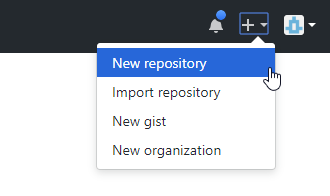
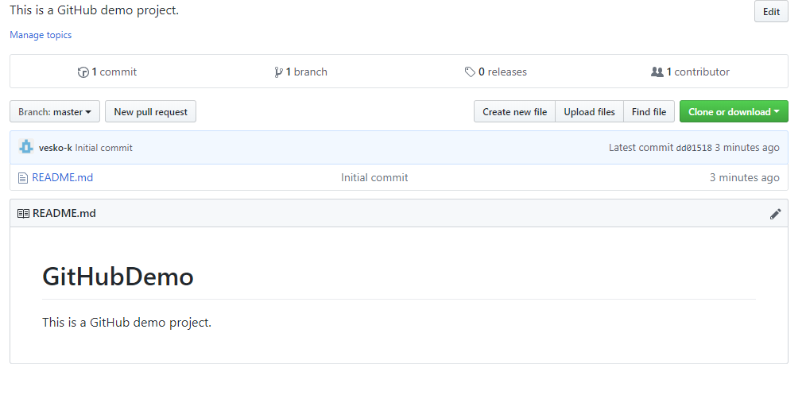
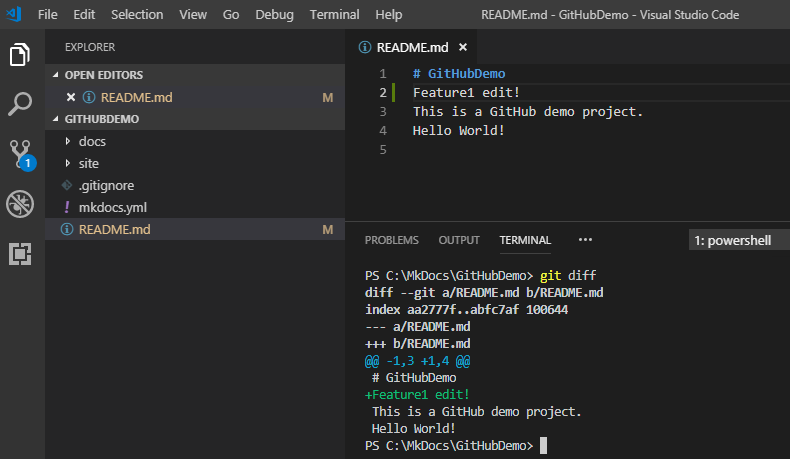
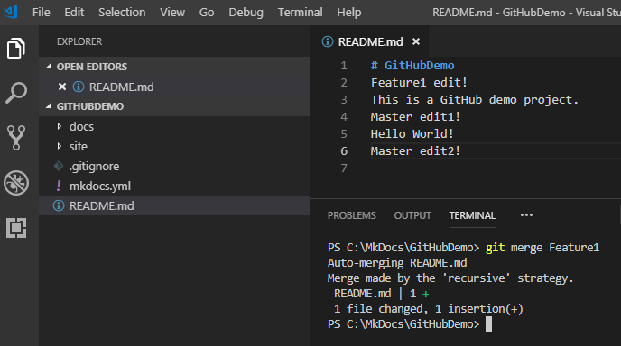
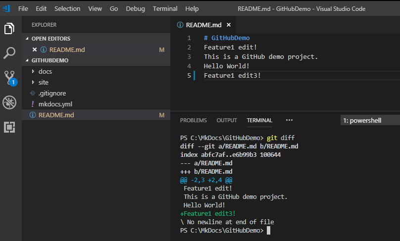

[TOC]

# Въведение

Система за контрол на версиите се ползва за записване на промените по
даден файл или колекция от файлове. Тя позволява да се запази история на
промените, да се върне предишна версия, да се добави описание на
промените (като например защо и на какво е извършена промяната и други).
**GIT** e една от най-известните и използвани децентрализирани системи
за контрол на версиите на файловете. Една от най-популярните
облачно-базирани **GIT** услуги е **GitHub**. За да може да използвате
**GitHub** е необходимо да имате регистрация. Ако все още нямате може да
я направите [тук](https://github.com/join) (<http://github.com/join>).

# Инсталиране на GIT за Windows
 
 **GIT** за **Windows** може да изтеглите от [тук](https://git-scm.com/download/win)
 (<https://git-scm.com/download/win>). Стартирайте инсталатора и следвайте стъпките.


**<center>фиг.50</center>**

Натиснете бутона "**Next**".


**<center>фиг.51</center>**

Натиснете бутона "**Next**".

По желание изберете "**Use Visual Studio Code as Git's default
editor**".


**<center>фиг.52</center>**

Натиснете бутона "**Next**".


**<center>фиг.53</center>**

Натиснете бутона "**Next**".


**<center>фиг.54</center>**

Натиснете бутона "**Next**".


**<center>фиг.55</center>**

Натиснете бутона "**Next**".


**<center>фиг.56</center>**

Натиснете бутона "**Next**".


**<center>фиг.57</center>**

Натиснете бутона "**Next**".


**<center>фиг.58</center>**

Натиснете бутона "**Install**" и изчакайте инсталацията да завърши.


**<center>фиг.59</center>**

Натиснете бутона "**Finish**".

# Създаване на проект в GitHub

След, като вече сте се регистрирали в **GitHub**, влезте с Вашият
профил в системата. От менюто горе вдясно изберете „**New
repository**".


**<center>фиг.60</center>**


**<center>фиг.61</center>**

Въведете име на проекта „**GitHubDemo**" и описание (по желание).
Изберете проекта да е публичен, това означава, че всички ще могат да
го виждат, но с права само за четене (за да направите проекта да не е
общодостъпен за четене, трябва да изберете опция „**Private**", която
обаче е платена). Може да поставите отметка на „**Initialize this
repository with a README**" за да добави **README** файл с по-детайлно
описание на конкретния проект, което в последствие може да
редактирате. Натиснете бутона „**Create repository**". В резултат
трябва да видите нещо подобно:


**<center>фиг.62</center>**

Повече информация за използването на **GitHub** може да прочете
[тук](https://help.github.com/) (<https://help.github.com/>).

# Закачване към проект в GitHub

Създайте нова папка в **C:\\MkDocs** с име "**GitHubDemo**". През
"**File Explorer**", десен клик върху папката "**GitHubDemo**" и
изберете "**Open With Code**".


**<center>фиг.63</center>**

От меню лентата на **VS Code** изберете **View** \> **Terminal** (може
да използвате и комбинацията от клавиши **Ctrl+\`**).


**<center>фиг.64</center>**

В резултат, в долната част на екрана ще се отвори терминален прозорец
със зареден **PowerShell**. С бутона „**+**" може да добавяте още
**PowerShell** прозорци, от падащият списък може да ги сменяте, а с
кошчето да ги изтривате.


**<center>фиг.65</center>**


**<center>фиг.66</center>**

В терминалния прозорец намиращ се в текуща папка **GitHubDemo**
напишете следната команда:

```
git init
```


**<center>фиг.67</center>**

В резултат на изпълнението ще се създаде скрита под-папка "**.git**",
в която се съдържат системните файлове на **Git** - информация за
проекта, измененията, адреса на източника и др.


**<center>фиг.68</center>**

Следващата стъпка е да зададем източника, там където е „**складиран**"
нашият проект. За целта първо си копирайте връзката до проекта Ви в
**GitHub**. Това може да стане, след като сте на страницата на проекта
Ви и натиснете зеленият бутон "**Clone or download**" и след това
натиснете ето този бутон  за да копирате линка.


**<center>фиг.70</center>**

След това отново в терминалния прозорец на **VS Code** напишете
следната команда:

```
git remote add origin https://github.com/vesko-k/GitHubDemo.git
```


**<center>фиг.71</center>**

С тази команда добавяме източник с име **origin**. Следващата стъпка е
да изтеглим файловете от **master** клона, което става със следната
команда:

```
git pull origin master
```


**<center>фиг.72</center>**

Сега вече може да пристъпим към създаването на документацията, за
целта ще отидем една папка нагоре, като напишем в терминала:

```
cd..
```

В резултат ще преминем една директория по-нагоре, откъдето ще изпълним
следната команда:

```
mkdocs new GitHubDemo
```

По този начин създаваме **MkDocs** проект **GitHubDemo**.


**<center>фиг.73</center>**


**<center>фиг.74</center>**

**VS Code** има вградена поддръжка на **Git**, която се активира
когато открие директория с име „**.git**", която се създаде в резултат
на изпълнението на командата „**git init**"

Вляво във **VS Code**, в дървото виждаме оцветени в зелено файлове,
това са нови файлове и директории, които по-късно ще качим в
**GitHub**.

Нека така създадения проект го компилираме. За целта в терминала на
**VS Code**, първо се връщаме в директорията **GitHubDemo**, след
което от там изпълняваме следната команда:

```
mkdocs build
```


**<center>фиг.75</center>**

След компилация се създаде папка "**site**", в която се намира
компилираният сайт на **MkDocs** проекта. Тази папка не искаме да я
качваме в **Git** системата, защото винаги може от **MkDocs** проекта
да го компилираме. За целта в папката **GuitHubDemo** ще създадем файл
с име "**.gitignore**", в който се описват изключените от **Git**
папки.


**<center>фиг.76</center>**

В момента, в който добавихме файла **.gitignore**, в който описахме
папката "**/site**", **VS Code** разпозна файла и директорията
„**site**" вляво се оцвети в бяло, което е признак, че папката е
изключена от **Git**.

Има два начина да качим направените промени. Единият е като използваме
**PowerShell** терминала на **VS Code** и с помощта на **Git** за
**Windows** качим промените в **GitHub**, другият е като използваме на
**VS Code** вградената поддръжка на **Git**.

В **PowerShell** прозореца изпълнете следната команда:

```
git status
```


**<center>фиг.77</center>**

В резултат ще видите в червено промените, както и съобщение с което
**Git** ви информира, че не е инструктиран да ги следи (вляво в зелено
оцветените файлове вдясно от тях има буква "**U**" от **untracked**
или не следен. За да се добавят файлове за следене се използва
командата

```
git add <име_на_файл>
```

На вместо да описваме всеки един файл по отделно ще изпълните следната
команда:

```
git add *
```

По този начин ще добавим всички файлове за следене накуп.


**<center>фиг.78</center>**

Ако отново напишем **git status** ще видим следното:


**<center>фиг.79</center>**

Всички файлове са зелени, което означава, че са добавени за следене
(вдясно от тях буквата се промени на "**A**", от **added** - добавени)
но промените не са потвърдени.

За да се потвърдят промените се използва командата **git commit**.

За целта в **PowerShell** терминала на **VS Code** напишете следното:

```
 git commit -m „Initial Commit"
```

Опцията `-m` ни позволява да дадем описание на това потвърждение.


**<center>фиг.80</center>**

Тъй като не са зададени потребител и електронна поща, **Git** иска да
се зададат:


```
git config user.email "въедете e-mail на регистрацията Ви в GitHub"

git config user.name "въедете потребителското име на регистрацията Ви в GitHub"
```

Ако поставите опция `--global`, това означава че настройката е
глобална, а не само за този проект. Но за сега ще я пропуснем.

Отново изпълняваме командата:

```
git commit -m "Initial Commit"
```

Този път трябва да е успешна и да видите следното:


**<center>фиг.81</center>**

На вместо да пишем `git add` и `git commit`, можем с една команда
да направим и двете:

```
git commit -am "Initial Commit"
```

Ако пак напишем `git status` ще видим следното:


**<center>фиг.82</center>**

Всички промени са потвърдени, но все още не са качени на сървъра. За
целта изпълняваме следното:

```
git push --set-upstream origin master
```

С опцията `--set-upstream` задаваме по подразбиране за следващите
команди да се използва **origin master**. Ако не го направим трябва да
посочим мястото където ще качваме промените всеки път, например:

```
git push origin master
```


**<center>фиг.83</center>**

Проекта е публичен за четене, но за да записваме трябва да имаме права
и да се автентицираме пред сървъра, затова въведете потребителското си
име и парола.

Тъй като посочихме клона, в който ще качваме, следващите промени може
да се качват направо с

```
git push
```

Може да прегледате качените промени на страницата на проекта Ви в
**GitHub**.


**<center>фиг.84</center>**

Умишлено отворих файла **README.md** и добавих в него ред с „**Hello
World!**", след което записах файла. В резултат файла се оцвети
 и вдясно буквата е „**M**" от
**modified** (променен).


**<center>фиг.86</center>**

Ако натиснете бутона , ще ви даде възможност да въведете
съобщение на промяната.


**<center>фиг.88</center>**

След което може да натиснем **Ctrl+Enter** за да направим **commit**
или да кликнем отметката .

Може да се появи следният прозорец, който казва, че няма добавени
файлове за качване и дали искате автоматично да добави всички
променени файлове и да ги потвърди директно. Натиснете бутона
"**Yes**"


**<center>фиг.90</center>**

За да качите на **Git** сървъра направените промени кликнете с мишката
върху  и после от падащото меню изберете
**Push**.


**<center>фиг.92</center>**

След, което ако отидете в **GitHub** на страничката на проекта ще
видите **3 commits**, десен клик върху тях ще ви покаже детайли за
промените:


**<center>фиг.93</center>**

А ето и последните промени как изглеждат:


**<center>фиг.94</center>**

# Други GIT команди

За да извикате помощ за дадена команда напишете в **PowerShell**:

```
git <команда> --help
```

Изпълнението на командата ще вдигне Уеб браузър и ще ви покаже локална
документация за командата, която търсите.

Например

```
git push --help
```
 ще отвори следната страница:


**<center>фиг.95</center>**

`git clone <git_url>` - клонира локално **Git** хранилище

`git log` - показва история на промените


**<center>фиг.96</center>**

`git reset`

`git reset --hard <commit>` - връща кода от предходната промяна(`commit`).

`git reset --hard origin/master` - връща последният код от сървъра от `master` клона.

`git branch` - показва всички разклонение на проекта


**<center>фиг.97</center>**

В нашият проект имаме само един клон с име `master`.

`git branch <branch_name>` - създава разклонение, копие на `master` към момента на извикване.

`git checkout <branch_name>` - превключва към зададено разклонение за работа.

`git merge <branch_name>` - слива разклонение с име `branch_name` с текущото разклонение.

Нека да създадем нов клон с име „**Feature1**". За целта изпълняваме
следната команда в **PowerShell** терминала на **VS Code**:

```
git branch Feature1
```


**<center>фиг.98</center>**

Ако изпълним командата `git branch` ще видим новото разклонение
**Feature1**. Звездичката пред `master`, означава че в момента се
намираме там. Ако искаме да отидем в **Feature1** трябва да изпълним
следната команда.

```
git checkout Feature1
```


**<center>фиг.99</center>**

Ако извикаме `git branch`, този път звездичката ще бъде пред
**Feature1**. Нека да променим **README.md**, като добавим един ред с
текст и запишем файла. В резултат, той ще се оцвети и ще се покаже буква
вдясно от името му "**M**" (**modified**).


**<center>фиг.100</center>**

Нека да поискаме да видим какви са промените с командата:

```
git diff
```

На фигурата по-долу виждате промените оцветени в зелено със знак
„**+**" означава че е добавен ред.


**<center>фиг.101</center>**

Нека потвърдим промените:

```
git commit -am "Feature1 Initial Commit"
```


**<center>фиг.102</center>**

Нека сега отидем в **master** клона:

```
git checkout master
```


**<center>фиг.103</center>**

Нека нанесем промяна отново в **README.md** файла.


И нека потвърдим промените:

```
 git commit -am "Master edit!"
```


**<center>фиг.105</center>**

Нека се опитаме да обединим двата клона.

```
 git merge Feature1
```

Трябва да се намираме в клона, в който ще обединяваме и от там да
кажем от кой клон ще се вземат промените, в случая се намираме в
**master** и ще обединяваме в него.


**<center>фиг.106</center>**

Обединението е успешно, а всички конфликти бяха автоматично решени.
Автоматичното обединение на файлове не винаги е добра идея.

Не винаги конфликтите могат да се решат автоматично. В **master** в
**README.md** добавете, както е показано ред "**Master edit3!**"


**<center>фиг.107</center>**

Потвърдете промените:

```
git commit --am "Master edit3"
```

След което отидете в **Feature1** клона:

```
git checkout Feature1
```

Въведете ред „**Feature1 edit3!**", както е показано по-долу.


**<center>фиг.108</center>**

Потвърдете промените:

```
git commit -am "Feature1 edit3!"
```

Преместете се отново в **master** клона:

```
git checkout master
```

И нека да направим обединение:

```
git merge Feature1
```


**<center>фиг.109</center>**

Както виждате, автоматичното обединение не успя да се справи с
конфликта и предлага 3 възможности:

-   да приемем промяната от **master** клона**;**

-   да приемем промяната от **Feature1** клона**;**

-   да приемем и 2-те промени;

За целта на теста нека да приемем и 2-те промени (за целта кликнте с
мишката върху "**Accept both changes**"). Нека видим промените като
изпълним командата **git diff**:


**<center>фиг.110</center>**

Виждаме, че конфликтните файлове са оцветени в лилаво, а в дясно
имат буква "**C**" от **conflict** (**конфликт**).

Ако искаме да се откажем от текущото обединение използваме
командата:

```
git merge --abort
```

Ако сме съгласни с промените трябва да ги добавим с командата:

```
git add *
```

След което за да завършим обединението трябва да изпълним:

```
git commit
```


**<center>фиг.111</center>**

В резултат се отваря файл, който Ви уведомява, че това е
потвърждение на обединяване, а ако случайно не е, прекъснете го с
**Ctrl+C** и прочете инструкциите във файла.


**<center>фиг.112</center>**

След затваряне на файла, обединението е приключено.
Остава единствено да качим промените на **Git** сървъра за целта
изпълняваме командата:

```
git push origin master
```

За да качим **Feature1** клона, отиваме в него:

```
git checkout Feature1
```

и изпълняваме командата:

```
git push origin Feature1
```

Може да отиде на страницата в **GitHub** на проекта Ви и да
разгледате промените.